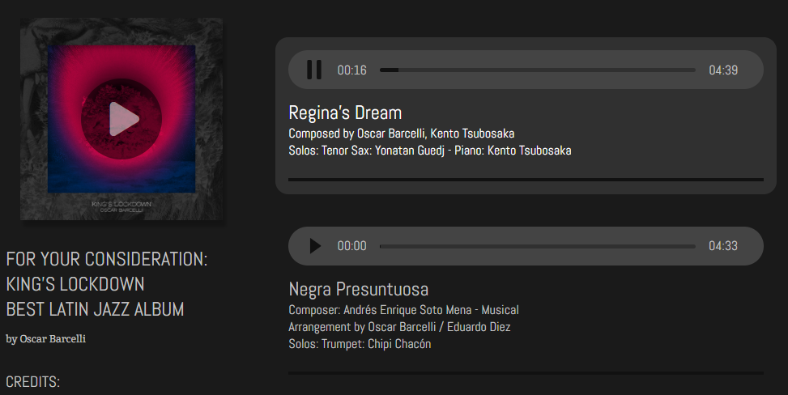

# King's Lockdown

## Introduction
SPA developed to showcase drummer Oscar Barcelli's album **King's Lockdown** (2021) for *Best Latin Jazz Album* consideration for the *Latin Grammy Awards*.

Feel free to listen to all of the songs and follow the artist on social media!

## Tech Stack

 
  
  
  

 
- HTML
- CSS
- JavaScript

## How to Run It

This is a Front End project, so no Back End language was used to set up a local server. You can visualize the final result using VSCode's *Live Server* extension.

UPDATE (06/09) - A temporary version was deployed on Heroku's platform [Link](https://powerful-beyond-84068.herokuapp.com/) 

## Features
For this project it was necessary to develop a customized audio player: 

The final result was based off of **Modern Web**'s video *How to create Music player with pure HTML, CSS, JS*. You can find their fantastic video over [here](https://youtu.be/Zf_psaJ-wP4).
